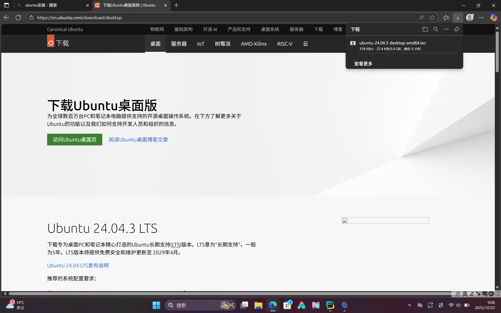

# 计算优化实验报告
## 李俊涵
第一次做这种类型的实验报告，完全没有经验捏，说实话在看到考题的时候就是无从下手，好在最后边学边做做完了。我对编程的了解仅限于我初高中上的微机课，一点基础都没有，只好在ai的带领下走一步看一步。如若做的不好也请学长多多包涵，尽力了。下面是实验报告正文。
## 1安装双系统
在此我要特别鸣谢李政阳学长，他提供了安装双系统的具体步骤，非常感谢。

我一开始在官网下载unbutu，但是下载速度过慢，于是我找到了清华大学开源镜像网站，在这里下载速度就快多了

然后将一个u盘当作启动盘并在硬盘上划分100g存储空间给linux系统

最后成功创建了双系统

## 2配备环境
我最后选择了pycharm，我觉得这个引入库写代码很方便

## 3纯python尝试
没有引入其他的库，用纯python实现了串行版本，当N和T很大时这段代码运行时间较长，效率低，但优点是简单。
```python
import random
import time
def random_walk_pure_python(L=512,N=100000,T=1000):
    particles=[(random.randint(0, L-1), random.randint(0, L-1)) for _ in range(N)]
    center_start=L//4
    center_end=3*L//4
    center_count=0
    start_time = time.time()
    for step in range(T):
        for i in range(N):
            x, y=particles[i]
            direction = random.randint(0, 3)
            if direction==0:
                y=(y-1)%L
            elif direction==1:
                y=(y+1)%L
            elif direction==2:
                x=(x-1)%L
            else:
                x=(x+1)%L
            particles[i]=(x,y)
            if center_start<=x<center_end and center_start<=y<center_end:
                center_count+=1
    total_time=time.time()-start_time
    avg_center_ratio=center_count/(N*T)
    return avg_center_ratio,total_time
ratio,t=random_walk_pure_python(N=100000,T=1000)
print(f"中心区域平均停留比例:{ratio:.6f},时间:{t:.2f}秒")
```


这是最终运行结果，耗费时长足足有半分钟，这是非常慢的。接下来就是用其他方法进行优化。
## 4引入numpy库进行优化
引入numpy库可以进行向量化计算，避免了一些繁琐的步骤。我一开始选择引入库计算是因为我没有学习别的编程语言，其实我也没学过numpy库的用法，边学边做并在ai的帮助下终于完成了numpy库优化。以下是代码展示
```python
import numpy as np
import time
def random_walk_numpy(L=512, N=100000, T=1000):
    x=np.random.randint(0,L,N)
    y=np.random.randint(0,L,N)
    center_start=L//4
    center_end=3*L//4
    center_count=0
    start_time=time.time()
    directions=np.random.randint(0,4,(T,N))
    for step in range(T):
        dirs=directions[step]
        mask_up=(dirs==0)
        mask_down=(dirs==1)
        mask_left=(dirs==2)
        mask_right=(dirs==3)
        y[mask_up]=(y[mask_up]-1)%L
        y[mask_down]=(y[mask_down]+1)%L
        x[mask_left]=(x[mask_left]-1)%L
        x[mask_right]=(x[mask_right]+1)%L
        in_center=(x>=center_start)&(x<center_end)&(y>=center_start)&(y<center_end)
        center_count+=np.sum(in_center)
    total_time=time.time()-start_time
    avg_center_ratio=center_count/(N*T)
    return avg_center_ratio, total_time
ratio,t=random_walk_numpy(N=10000,T=100)
print(f"中心区域平均停留比例:{ratio:.6f},时间:{t:.3f}秒")
```

这是优化后的结果，仅耗时0.03秒，这让我体会到了计算优化的重要性，竟然让运算耗时缩短这么多。我知道肯定会有更多手段让时间进一步缩短，但对我来说已经到极限了，没时间了。

## 5可视化尝试

引入了Matplotlib库生成了这样一张基础可视化散点图，不过更高级的我就不会了。

### 总结
终于是做完这份实验报告了，不管怎么样，总算是交上了一份答卷。第一次做这种实验报告，如果有做的不好的地方也请多多包涵。真做起来才发现自己什么都不会，我是一个计算机小白嘛。什么走得去学，选择计算优化赛道完全是因为我比较喜欢数学，也想通过用计算机的方式来解决数学问题，机器解决数学问题听着就很棒不是吗。这一次的实验报告让我学会了很多，也希望我以后会变得会更好，梦想成为一个计算机大神。
#### 特别鸣谢：   太阳学长    deepseek    豆包 
